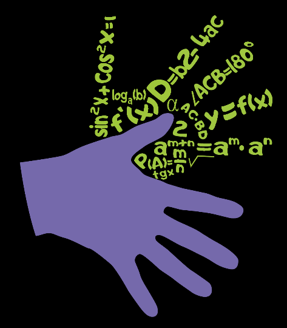

# Sign-language-AI-papers

**Sign-language-AI-papers** is a curated list of *Sign language artificial intelligence papers* papers, articles, tutorials, slides and projects. **Star** this repository, and then you can keep abreast of the latest developments of this booming research field. Thanks to all the people who made contributions to this project. Join us and you are welcome to be a contributor.

# What is Sign language AI?
*Sign language AI* provides methods and processes to make machine translate of Sign language available for Deaf people and researcher, to improve efficiency of intelligence research and to accelerate research on Sign language and gesture.
